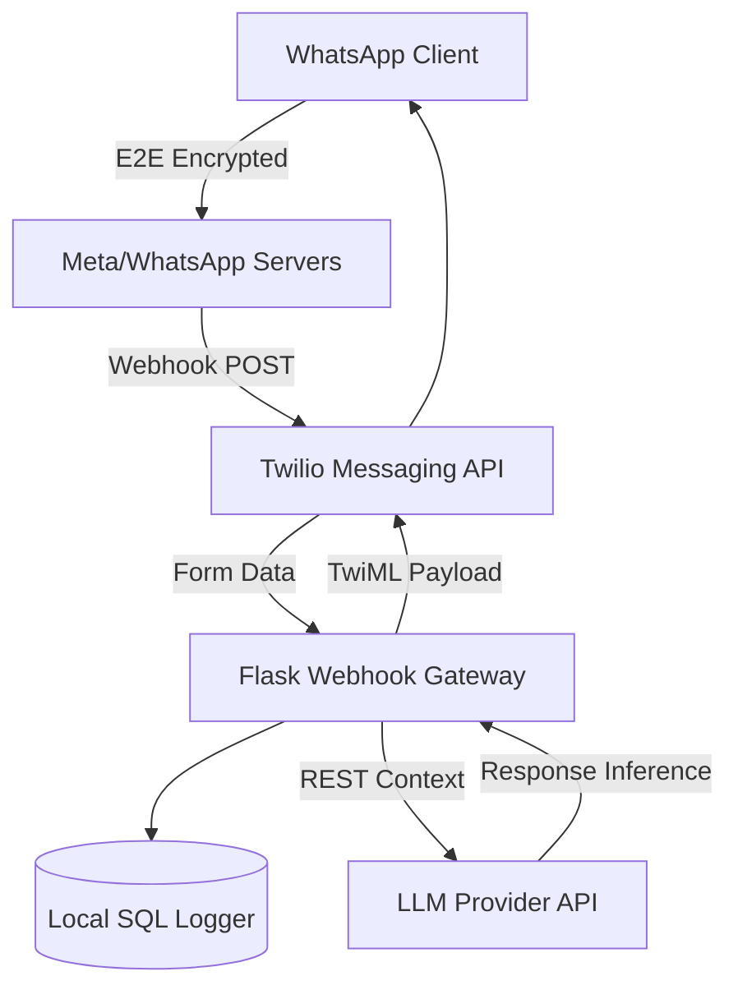

# WhatsApp Conversational AI Agent

[](https://python.org)
[]()
[]()
[]()

## Overview
This repository contains a context-aware WhatsApp conversational agent engineered using Flask, the Twilio Messaging API, and modern LLM providers. It acts as an autonomous customer interaction endpoint, parsing incoming WhatsApp payloads, maintaining dialogue history, and persisting chat logs into a localized SQL database.

## Problem Statement
Small-to-medium businesses lack the engineering bandwidth to build custom Natural Language Understanding (NLU) pipelines for WhatsApp Business channels. Traditional rule-based bots (Typeform/ManyChat) offer rigid, frustrating user experiences. This project solves that by proxying unstructured WhatsApp messages directly to a Generative AI model, dynamically fulfilling user intents without requiring pre-programmed decision trees.

## Key Features
- **Webhook Architecture:** Securely consumes and validates `POST` payloads from Twilio's WhatsApp Sandbox.
- **LLM Fulfillment Pipeline:** Seamlessly routes user queries through advanced AI models to generate human-like responses.
- **Context Persistence:** Logs message IDs, timestamps, and sender states into a relational database to provide the LLM with conversational context.
- **Synchronous Execution:** Built on Flask for immediate prototype deployment on standard WSGI servers (Gunicorn/Waitress).

## Architecture



## Technology Stack
- **Framework:** Python 3.11, Flask
- **Messaging Gateway:** Twilio WhatsApp API (TwiML)
- **Database:** SQLite / SQLAlchemy
- **Testing:** Pytest, unittest.mock

## Project Structure
```text
whatsapp-ai-chatbot/
├── app/
│   ├── __init__.py          # Application factory
│   ├── config.py            # Environment validation
│   ├── utils.py             # LLM API abstractions
│   └── webhook.py           # Twilio POST request routing
├── tests/                   # Pytest mocking suites
├── run.py                   # WSGI server entry point
├── requirements.txt         # Production dependencies
└── README.md                # System documentation
```

## Installation
```bash
git clone https://github.com/krsna016/whatsapp-ai-chatbot.git
cd whatsapp-ai-chatbot
python3 -m venv venv
source venv/bin/activate
pip install -r requirements.txt
```

## Usage
1. Configure your `.env` variables (Twilio SID, Auth Token, LLM API Keys).
2. Start the local Flask server:
```bash
python3 run.py
```
3. Use a tunneling service (e.g., `ngrok`) to expose port 5000 to the public internet, and paste the tunnel URL into your Twilio WhatsApp Sandbox configuration.

## Examples
*Example Twilio Form-Data Payload handled by the Webhook:*
```json
{
  "SmsMessageSid": "SM123...",
  "NumMedia": "0",
  "ProfileName": "Customer",
  "Body": "Can you check my order status?",
  "From": "whatsapp:+1234567890"
}
```

## Screenshots
> [!NOTE]
> *WhatsApp iOS client interaction screenshots are pending capture.*

## Visual Demonstrations
> [!NOTE]
> *A GIF demonstrating the real-time fulfillment speed is being generated.*

## Testing
Webhook routing and Twilio response generation are verified using Flask's native `test_client`.
```bash
pytest tests/
```

## Performance Notes
- **WSGI Blocking:** Because LLM inference requests are inherently blocking I/O calls, the underlying Gunicorn deployment must utilize `gevent` workers to handle concurrent inbound WhatsApp messages without dropping HTTP connections.

## Future Improvements
- **Asynchronous Migration:** Refactoring the core routing from Flask to FastAPI to natively support asynchronous I/O during LLM inference.
- **RAG Integration:** Connecting the LLM context to an internal vector database for company-specific Q&A.

## Contributing
Please ensure all webhook payloads are properly validated via Twilio's HMAC signatures before merging any pull requests related to the `webhook.py` endpoint.

## License
Licensed under the MIT License.
